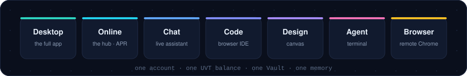
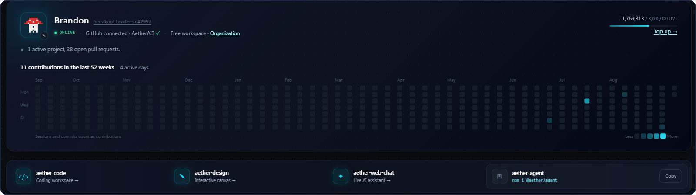
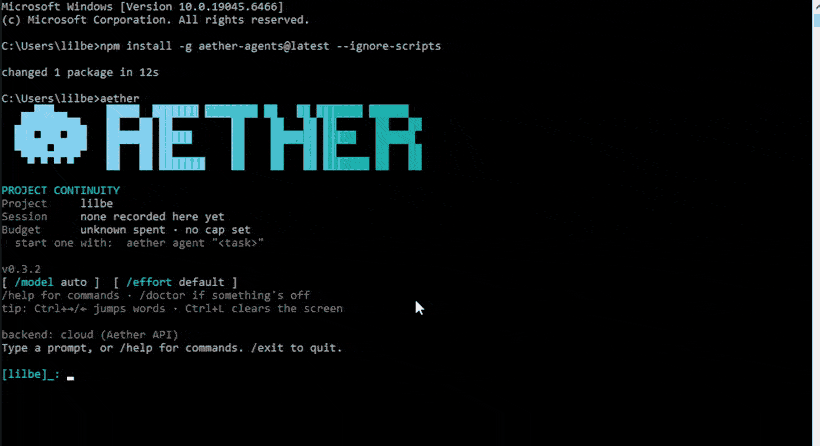
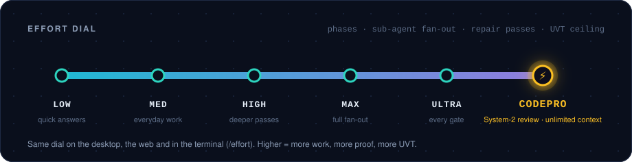
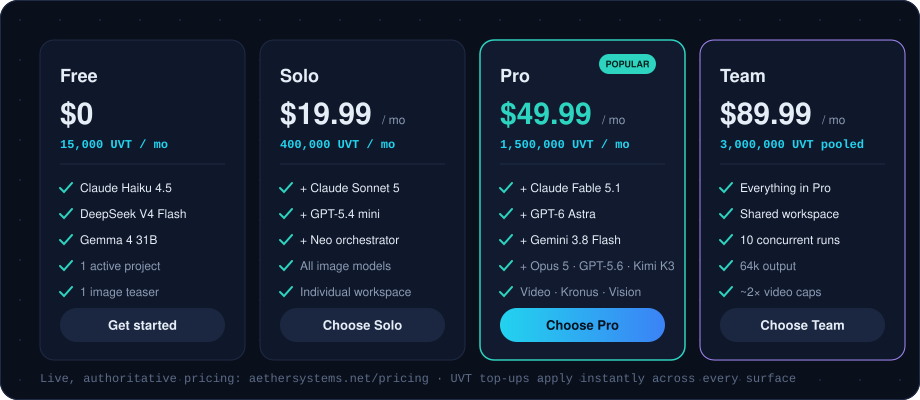
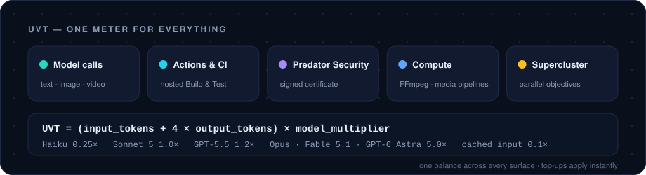
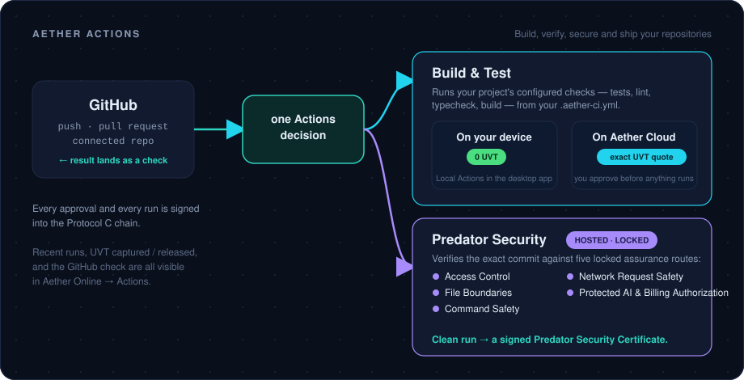
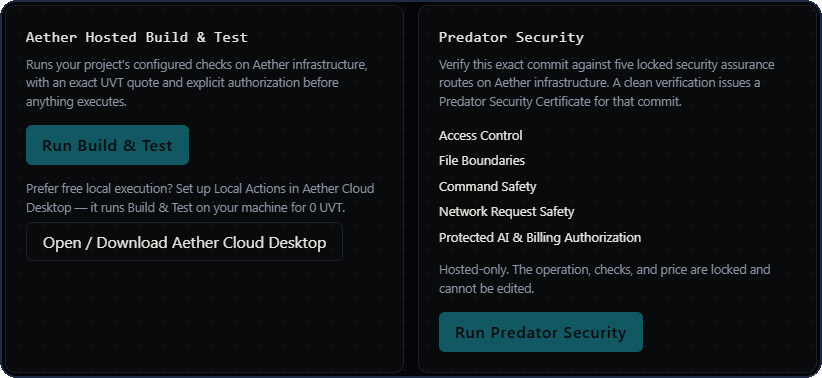
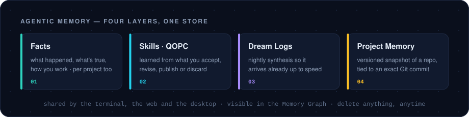
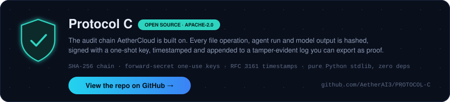

<div align="center">

# Aether Cloud


### The desktop app for the Aether AI platform.

Agents, projects, workflows, a living Vault and signed proof — on your machine,
connected to the same account you use on the web and in the terminal.

<br />

[](https://aethersystems.net/download)
[](https://aethersystems.net/aether-cloud)
[](https://aethersystems.net/pricing)
[](RELEASE_NOTES.md)

[](#beta)
[](https://aethersystems.net/download)
[](https://github.com/AetherAI3/aether-agent)
[-2dd4bf?style=flat-square&logo=github)](https://github.com/AetherAI3/PROTOCOL-C)

</div>

<!--
  DESKTOP DEMO GIF — record a short loop (open a project → run an agent team →
  result lands in the Vault with its proof entry), save it as
  assets/aethercloud-demo.gif, and swap the hero image above for:
  
-->

> ## Stop chatting with AI. Start commanding a fleet.
>
> AetherCloud is where the work actually happens: teams of agents read your
> files, build multi-step results, and drop them back into your Vault — while you
> watch, or while you sleep. Every file operation and every model output is
> signed into a chain of custody you can read, search and export.

<a id="beta"></a>
> **AetherCloud is in beta.** It's used every day and updated constantly, so
> things will move under you sometimes. If something breaks, tell us — issues
> here, or security reports through [SECURITY.md](SECURITY.md).

<br />

## One connected platform

One account. One balance. One memory. Pick the surface that fits the moment.

<div align="center">


<br />

[](https://aethersystems.net/platform/online)
[](https://app.aethersystems.net/chat)
[](https://app.aethersystems.net/code)
[](https://app.aethersystems.net/design)

[](https://github.com/AetherAI3/aether-agent)
[](https://github.com/AetherAI3/agent-browser)

</div>

- **AetherCloud Desktop** — the full app: agent teams, the Coder IDE, workflows, Vault, Voice, proof logs.
- **Aether Online** — the hub: projects, repositories, memory, connectors, collaborators, logs, Actions. Home of the Aether Project Runtime.
- **Chat · Code · Design** — the web. Research and hand off to agents, code in the browser with the same backend as the desktop, or work on a visual canvas.
- **Aether Agent** — the open-source coding agent for your terminal. Hosted models or your own local Ollama.
- **Aether Browser** — a real Chrome your agent drives, with a live view you can take over. Built into Aether Agent, runs on Aether Cloud.

<div align="center">

<br />
<sub>Aether Online — the hub. Everything above talks to the same Aether API and writes to the same Vault and memory.</sub>
</div>

<br />

## The desktop app

AetherCloud is a native Windows app. It is not a chat window with a file picker.

| | |
|---|---|
| 🤖 **Agent teams** | Build agents in the Agent Studio — name, role, model — group them into teams, deploy the team on a task. Teams use MCP servers, a skills library, and a sandboxed browser when a task needs the live web. **Neo** plans and fans out, **Kronus** audits and repairs, **Aether-Vision** chains image and video models from one prompt. |
| 🗂 **Projects + Coder IDE** | Open a project and work next to the agents on one surface: browse the tree, run builds, review diffs, let agents edit alongside you. Git, terminal, a media viewport, and **Local Actions** built in. |
| ⚙️ **Workflows** | Chain agents into a repeatable pipeline — draft → build → verify → file — then schedule it in plain English (*"every weekday at 9am"*). It runs unattended and lands signed output in your Vault. |
| 🗄 **The Vault** | The working memory your agents reason from: your files, your past work, your decisions, rendered as a searchable galaxy. It syncs to Aether Online, so the same context is in your browser and your terminal. Your files never touch a third-party cloud. |
| 🎙 **Voice** | Talk to the same agent you type to. [Aether Voice](#aether-voice). |
| 🧾 **Proof logs** | Read and export the signed record of everything that happened. [Provenance](#provenance--protocol-c). |
| 🧠 **Memory** | Let the system learn how you work. [Agentic memory](#agentic-memory). |

<br />

## Aether Agent — the terminal

**[Aether Agent](https://github.com/AetherAI3/aether-agent)** is the open-source
(Apache-2.0) coding agent that bridges into the same platform. It reads your
repository, makes the change, runs the checks you name, and shows you the exit
code. Hosted models through your Aether account, or local Ollama with no account.

<div align="center">

<br />
<sub>Install → launch → <code>/help</code> → <code>/models</code>. That's the whole first run.</sub>
</div>

```bash
npm install -g aether-agents@latest --ignore-scripts
aether auth login
aether
```

- **Proof, not claims.** `--test-cmd` ties "done" to a real command and a real exit code.
- **The effort dial.** `/effort` from `LOW` to `CODEPRO` — the same dial the desktop uses.
- **Project Memory.** `aether -m` commits a versioned memory snapshot of your repo, linked to the Git commit, and pushes it to your project on Aether Online.
- **Review → ship.** `aether review` picks what goes in, `aether ship` opens the pull request — and never publishes without naming the action.

### Aether Browser — the built-in remote browser

When an agent hits a login, a 2FA prompt, or a portal with no API, it gets a
**real Chrome**, driven over MCP, with a live view you can watch from any device
and **take over** the moment a human is needed. The agent pauses, you log in,
the agent resumes. It runs on Aether Cloud (or self-hosted), it's built into
Aether Agent's remote-session (`/rc`) flow, and it ships standalone as
[agent-browser](https://github.com/AetherAI3/agent-browser)
(`npm i aether-browser` · `pip install aether-browser`).

<br />

## Aether Online & the Project Runtime

**[Aether Online](https://aethersystems.net/platform/online)** is the hub. It is
also where the newest piece of the platform lives.

### APR — Aether Project Runtime

APR is the runtime under every Aether project. One project identity crosses
every surface; the project carries its **graph** (persistent knowledge), its
**DAG** (active execution state), and its **proof**.

```text
you  →  Aether Online  →  Aether Project  →  Aether API  →  the right capability
```

- **GitHub integration.** Connect a repository and the project follows it — branches, pull requests, checks and deployments show up in the hub, and Actions results land back on GitHub as checks.
- **MCP routing.** Aether is an MCP server. Point **Claude**, **GPT / Codex**, **Hermes** or any MCP client at it and those agents can drive Aether models, project memory and media tools directly — other agents become connectors into your project, not separate silos.
- **The Aether API.** The single programmatic entry: the model fleet, the **memory graph**, project memory (`status / get / stage / commit / open`), media generation and the asset library, development context and lanes, and bounded **Supercluster** runs — plan first, then dispatch with scoped, one-use authority.
- **Supercluster, behind the curtain.** When an objective needs parallel work, Aether organizes a Supercluster of agents for you. You never configure workers or a DAG by hand.

<br />

## Effort levels and CodePro

Every run has an effort dial. It moves how many phases run, how many sub-agents
fan out, how many repair passes happen, and the UVT ceiling for the run.

<div align="center">

</div>

**CodePro** is different in kind, not just in size. It switches on two things:

1. **Unlimited context.** The run gets a dedicated space — a large overpool with
   quantized recall and a context chain — so a long session never loses its own
   investigation past the model's window. That's
   [Unlimited Context](https://github.com/AetherAI3/Unlimited-Context-LLM),
   Aether's open-source engine, doing the heavy lifting.
2. **The System-2 compiler.** Instead of forty agents with forty private
   scratchpads, CodePro keeps one **live, shared transcript** — a compact
   intermediate representation every agent reads and writes. A 40-agent workflow
   is 40 agents, **one compiled mind**, orchestrated. The answer still comes back
   as plain prose.

<div align="center">

**CodePro on SWE-bench** — same model, same tasks, official harness. Only the memory layer differs.

| Instances | Model alone | CodePro | Lift |
|---:|---:|---:|---:|
| 27 | 3 (11.1%) | 7 (25.9%) | 2.33× |
| 89 | 6 (6.7%) | 16 (18.0%) | 2.67× |
| **180** | **14 (7.7%)** | **27 (15.0%)** | **1.93×** |

<sub>SWE-bench-lite, scored by the official Docker harness. Model fixed at <code>gpt-4.1-mini</code> — the engine's value is clearest on a base model that forgets. The defensible large-sample claim is <b>~2× more real bugs fixed</b>, and CodePro led at every checkpoint.</sub>

</div>

<br />

## Models and tiers

One fleet across every surface. Models unlock by tier; what your account can
reach right now is whatever `aether models` prints while signed in, or the
picker in the app.

<div align="center">
<a href="https://aethersystems.net/pricing"></a>
</div>

| Tier | Unlocks |
|---|---|
| **Free** | Claude Haiku 4.5 · DeepSeek V4 Flash · Gemma 4 31B · one image teaser · 1 active project |
| **Solo** | + Claude Sonnet 5 · GPT-5.4 mini · Neo orchestrator · every image model |
| **Pro** | + **Claude Fable 5.1 · GPT-6 Astra · Gemini 3.8 Flash** · Claude Opus 4.8 / Opus 5 · GPT-5.5 · GPT-5.6 Sol / Terra / Luna · DeepSeek V4 Pro · Kimi K2.6 / K3 · Qwen 3.8 Max · Grok 4.6 · Gemini 3.6 Flash · video generation · Kronus · Aether-Vision |
| **Team** | Everything in Pro, pooled across seats, 10 concurrent runs, 64k output, ~2× the video caps |

<details>
<summary><b>Image, video and orchestrator catalogue</b></summary>
<br />

**Image:** Nano Banana / Nano Banana 2 / Nano Banana Pro · FLUX.2 Klein / Pro / Flex / Max · Recraft V3 / V4 · Seedream 4.5 · Riverflow V2 Fast / Pro · GPT-5 Image / Image Mini · GPT Image 2

**Video:** Seedance 1.5 Pro / 2.0 / 2.0 Fast · Veo 3.1 / Fast / Lite · Kling 3.0 Standard / Pro / Video O1 · Sora 2 Pro · Wan 2.6 / 2.7 · Hailuo 2.3 · Grok Imagine Video · HappyHorse 1.0

**Orchestrators:** **Neo** plans, decomposes, fans out to workers and assembles the result. **Kronus** runs a deep audit chain — scan, cross-reference, find, fix. **Aether-Vision** pairs a reasoning brain with the vision fleet so one prompt plans, prompt-engineers and renders image → video in a single run.

</details>

<br />

## UVT — one meter for everything

**UVT is Aether's universal compute credit** — the billing system behind every
product. One balance, shared across the desktop app, Aether Online, Chat, Code,
Design and the terminal. You see the cost of a thing as it happens, not on an
invoice later.

<div align="center">

</div>

A subscription includes a monthly pool; **top-ups** go beyond it on demand and
apply instantly everywhere. Media is priced per image or per second of video,
scaled to the vendor's real cost. Per-model monthly caps sit on top of the plan
pool so one expensive model can't drain a month in an afternoon. Full rate card:
[PRICING.md](PRICING.md).

<br />

## Aether Actions and CI

Actions is how work gets verified and shipped. Connect GitHub in Aether Online,
pick a repository, and every push or pull request can trigger a run. The result
shows up in **Recent runs** with the UVT it captured and released — and on the
pull request as a check.

<div align="center">

</div>

There are two products behind that one decision:

**Build & Test** runs your project's configured checks — tests, lint, typecheck,
build. Run it **on your device** through Local Actions in the desktop app for
**0 UVT**, or **on Aether Cloud** with an exact UVT quote and your explicit
authorization before anything executes. Either way, the coding agent can drive
the loop itself: run → read failures → fix → re-run → green.

**Predator Security** is a separate security CI, hosted-only. It verifies the
exact commit against five locked assurance routes — Access Control, File
Boundaries, Command Safety, Network Request Safety, Protected AI & Billing
Authorization — and a clean run issues a **Predator Security Certificate** for
that commit. The operation, checks and price are locked and can't be edited, so
a certificate means the same thing for every repo.

<div align="center">

<br />
<sub>Actions in Aether Online — one click for Build &amp; Test, one for Predator Security.</sub>
</div>

<details>
<summary><b>Local Actions — the <code>.aether-ci.yml</code></b></summary>
<br />

Drop this in the repo root. Checks run in the app sandbox on your machine — no
cloud compute, no metering. Three gates, any subset: block `git commit`, block
`git push`, or expose a read-only `ci_run` tool to the coding agent. You approve
the exact commands once; the agent can never self-approve.

```yaml
version: 1
gates:
  commit: false
  push: true
  agent: true
checks:
  - name: tests
    type: test
    run: pytest -q
  - name: lint
    type: lint
    run: ruff check .
```

</details>

Every approval and every run is signed into the Protocol C chain. A signer
outage logs the run as `UNSIGNED`; it never blocks your local checks.

<br />

## Agentic memory

Most AI tools start from zero every session. AetherCloud doesn't. Memory lives
in the cloud, keyed to you, and every surface reads the same store — teach it
once anywhere, it knows everywhere.

<div align="center">

</div>

- **Facts** are extracted from your sessions, scored for importance and confidence, and re-scored over time — episodic, semantic and behavioral, global or per-project.
- **Skills (QOPC)** — the Quantum Optimized Prompt Circuit watches what you accept, revise, publish or discard and tunes its own prompt weights. No config, no fine-tuning; it gets better the more you use it.
- **Dream Logs** cluster what was learned between sessions and write a short synthesis, so the system arrives already up to speed.
- **Project Memory** is a versioned snapshot of a repository, tied to an exact Git commit — commit, push, pull, diff, reconcile. Git, for memory.

The **Memory Graph** in Aether Online shows how your code, memory and Vault
connect. Memory chips appear inline in chat so you can see what the agent is
drawing on. Retrieved memory is evidence for the agent, never instructions.

<br />

## Provenance — Protocol C

<div align="center">
<a href="https://github.com/AetherAI3/PROTOCOL-C"></a>
</div>

Every file operation, agent run, model output, auth event and chat turn is
**hashed** (SHA-256), **signed** with a one-shot key that's destroyed after use,
**timestamped** (RFC 3161), and **appended** to an immutable log that chains to
the entry before it. A tampered response fails its signature and the system
refuses to proceed.

The log is **viewable** in the Logs tab and the Aether Online hub, **searchable**
by event type, and **exportable** as an evidence-grade proof package you can
hand to an auditor, a client or a court. The chain itself is open source —
AetherCloud is built on it. Patent pending.

Two more things sit on top of it: **ATLAS**, a ground-truth engine between your
models that keeps outputs anchored to verified reality, and **Predator**, whose
security certificates are signed into the same chain.

<br />

## Aether Voice

Voice isn't a separate app. The mic in the composer opens a session that speaks
into the **same chat thread**, runs the **same agent** — same tools,
permissions, memory and billing — and renders into the same transcript. Typing
and talking are two inputs to one conversation.

- **Live conversational awareness.** The surface you're on tells Voice what's on screen — the file you have open, the project you're in, the terms in front of you — so it stays in context instead of guessing.
- **Barge-in.** Start talking while it's speaking and it stops, drops the synthesis, cancels the stream and listens.
- **Streaming speech.** Replies are chunked and voiced as they arrive, in order, with markdown turned into something that sounds right out loud.
- **Provider failover.** If one voice provider stumbles, the next picks up mid-turn.

<br />

## Get AetherCloud

<div align="center">

[](https://aethersystems.net/download)

</div>

1. **Download** — the installer provisions its own runtime (Node, Git, ripgrep). About a minute.
2. **Sign in** with your Aether account — the same one for [app.aethersystems.net](https://app.aethersystems.net) and `aether auth login`.
3. **Open a project, deploy a team.** Or just ask it something.

Want the terminal too? `npm install -g aether-agents@latest --ignore-scripts`
(or `pipx install aether-agent`), then `aether auth login`. Upgrade or top up
anytime at [aethersystems.net/pricing](https://aethersystems.net/pricing).

<br />

## Security and this repository

This repository holds the AetherCloud product docs, release notes and media. It
does not contain the application source. Security reports go to
**security@aethersystems.net** — see [SECURITY.md](SECURITY.md).

AetherCloud is proprietary. [Aether Agent](https://github.com/AetherAI3/aether-agent),
[Aether Browser](https://github.com/AetherAI3/agent-browser),
[Unlimited Context](https://github.com/AetherAI3/Unlimited-Context-LLM) and
[Protocol C](https://github.com/AetherAI3/PROTOCOL-C) are open source under
Apache-2.0. [Terms](TERMS.md).

---

<div align="center">

**AetherCloud** — Aether AI LLC · Proprietary · Patent Pending #64/010,131 · All Rights Reserved

Created by **[Brandon Barrante](https://github.com/AetherAI3)** · founder, Aether AI

[Download](https://aethersystems.net/download) · [Product page](https://aethersystems.net/aether-cloud) · [Aether Online](https://aethersystems.net/platform/online) · [Pricing](https://aethersystems.net/pricing) · [Release notes](RELEASE_NOTES.md) · [Terms](TERMS.md) · [Security](SECURITY.md)

</div>
